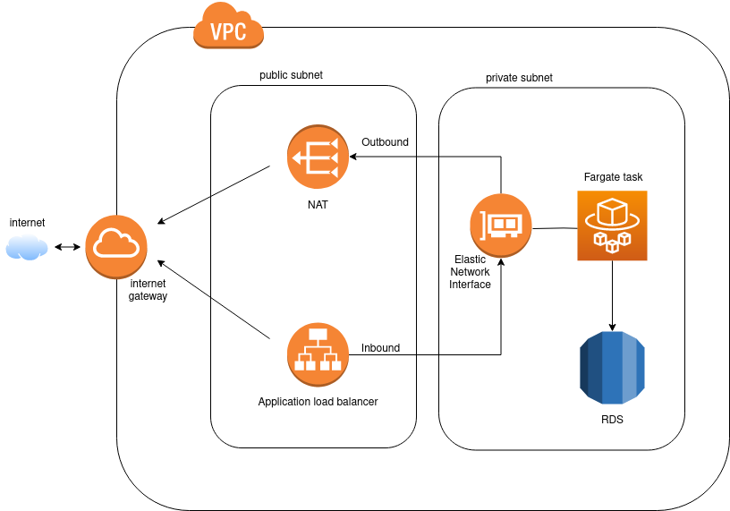

## Overall

* Automatically built a record in route53 hosted zone and directed to the application load balancer.
* ALB directs the traffic to 443 for https and automatically created ACM for this https
* Built the infras with ECS fargate at multi-AZs with two private subnets.
* Created ALB for inbound and NAT for outbound
* Auto scailing on Fargate
* RDS in private subnet

## AWS infrastructure



## Pre requisites

* Terraform
* AWS Cli (IAM user with permissions in IAM, ECS, VPC, ALB, RDS ...)
* An hosted zone in route53

## Process instructions

Change the variables in the tf-file-fargate [terraform.tfvars](./tf-file-fargate/terraform.tfvars)

And get into the tf-file-fargate directory run
```
Terraform init
Terraform apply -auto-approve
```

For destroy all resources run
```
Terraform destroy -auto-approve
```

if want use terraform state file and lock file, need to build a bucket in s3 and dynomodb.

## Security

* Private and public subnets
* Security groups
* NAT
* ACLs
* ACM

  and ...

## Auto scaling

Auto scaling for fargate with two metrics: memory and CPU

## Highly available frontend

Multi-AZ for Fargate

## Highly available Database

Could build Multi-AZs for Database (will cost a lot so no use in this case)


